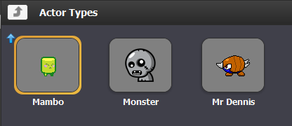
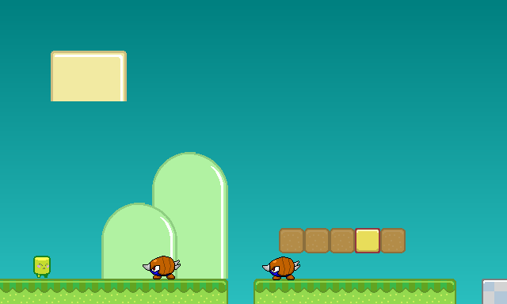
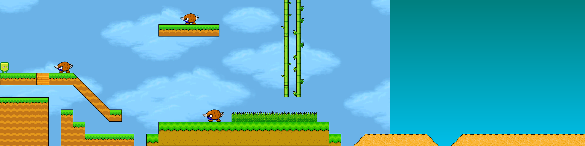
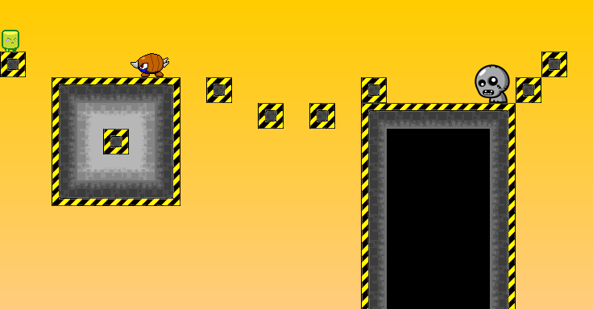

##Taller sobre desarrollo de videojuegos 
Este videojuego es el resultado de un taller que impartí a personas principiantes en el mundo de la programación, está basado en el material de enseñanza de Stencyl.

***Algunas imagenes del juego:***
####Actores

####Level 1

####Level 2

####Level 3

###Temario:
####Lección 1 - Cómo hacer tu primer videojuego

* ¿Que es un juego?
* Cómo funcionan los juegos
* Una breve introducción a Stencyl
* Opcional completar Tópico 1.
* Proyecto 1 - Mi Primer videojuego.

####Lección 2 - Pensamiento Lógico

* ¿Cómo funcionan los programas ?
* Condiciones
* Operadores Lógicos
* Opcional Completar Tópico 2

####Lección 3 - Eventos

* ¿Que son Eventos?
* Cómo funcionan las Variables
* Sistema de coordenadas
	
####Lección 4 - Inteligencia Artificial

####Lección 5 - Proyecto final 

* Space invader o Mejorar Proyecto 1

###Topicos Adicionales:
-	Completar el tutorial de flappy Online. [Flappy](https://studio.code.org/flappy/1)
-	Agregar 1 Nivel Extra al Primer Proyecto. 
-	Agregar 1 Nivel Extra al Segundo Proyecto.

Notas: El contenido del curso es una versión simplificada del curso para profesores de Stencyl. [Material Educativo] (http://www.stencyl.com/teach/)
Proyecto 1 y 2: [Crash Course Kit Tutorial](http://www.stencyl.com/help/start/)

###Requerimientos de hardware para correr Stencyl 
Hardware:
-	1 gb RAM
- Dual Core 

Software:
-	Windows 7
- Java 8
-	Stencyl 3.3.1 o superior

### Support

Sergio Peralta serpel.js@gmail.com

Please file issues [click here] at Github. 

Copyright (c) 2016 Sergio Peralta. This software is licensed under the MIT License.

Good luck!

[click here]:https://github.com/serpel/StencylCrashCourse/issues

### Contributing

Fork it
Create your feature branch (git checkout -b my-new-feature)

Commit your changes (git commit -am 'Add some feature')

Push to the branch (git push origin my-new-feature)

Create a new Pull Request
